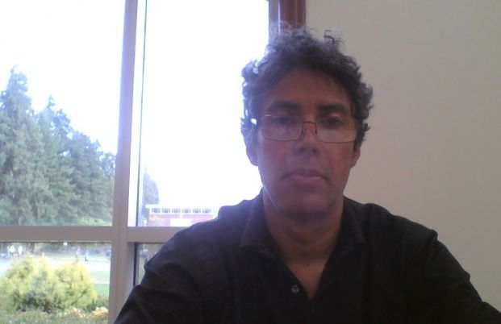

# Introduction
I was born in Brasil.
I moved to USA years ago where I have been living since then.
I am Spanish Science Instructor at High School. 
I have Bachelor of Science in Genetics from University California Davis
After that I continued towards my Master in Science in Cell and Molecular Biology at San Francisco State 
University.

## My research interests
I am interested in how our ”self", our "persona" arises from living tissue. 
When a group of neurons start to have characteristics of cognition?When a group of neurons start to have characteristics of cognition?
When a neural activity starts to produce coherent activiyt that it is perceived as cognition ?
When a group of neurons start to "think"?
Those are questions that I want to reply with my research. 

## Online Teaching
I am teaching an online science for students. I have google classroom where I teach students science. My google classroom is located at 
I also have office hours from after class at :

- Physics
- Math
- Biology
- English

**Projects** 
- Artificial Intelligence

## Images
See some of my images from my projects.
Those images bellow are pictures of my samples.
<figure>

<figcaption>Figure1 Jason</figcaption> </figure>

<figure>
 
<figcaption>Figure2 Jason</figcaption> </figure>

<figure>
 
<figcaption>Figure3 Jason</figcaption> </figure>

### Contact Information

You can contact me by email: [jasonmejiaoregon@gmail.com](jasonmejiaoregon@gmail.com) or skype.

### Support or Contact

Having trouble with Pages? 
# References

1. Jason.
2. [Jason]
3. Mejia, Jason.
4. Mejia, Jason.
